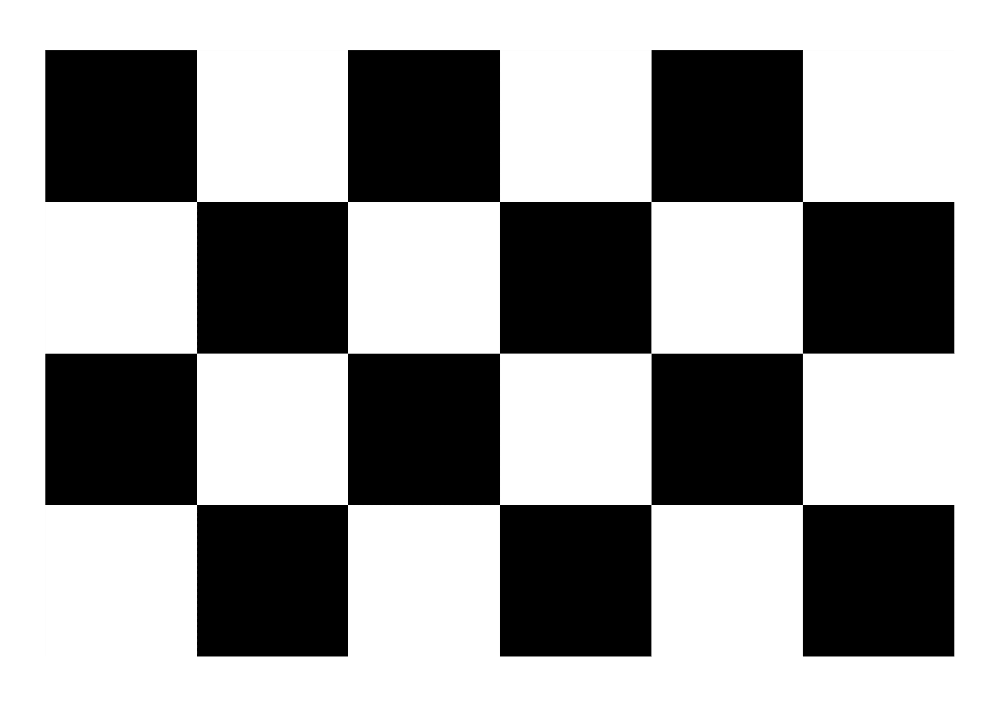
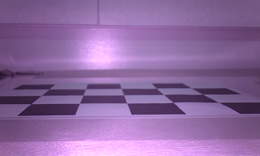

# 地面深度

## python环境配置
首先确认按照[python环境配置](../python_env/contents.md)进行python环境的准备

## 采集数据
首先打印一张如下的棋盘格子，并量取打印好的棋盘格子的方格大小。如0.045米。
将棋盘格子平整的平铺在地面上，或者某个平面上（不能有任何起翘，褶皱），并用胶带固定住。注意点可以参见[双目标定-采集数据](../stereo_camera_calibration/contents.md)


接着将扫地机机器人（相机模组的位置已经固定于机器人上，和生产后使用时的位置一致）置于棋盘格子所在平面上，对棋盘格子进行图片拍摄。拍摄时，需要棋盘格子背景干净，比如贴在白色板子上，其他处背景也为白色（如白墙）。其次，需要保证拍摄结果的棋盘格子清晰可见（光亮不足需要补光）。如下图所示：


## 地面深度文件获取
通过运行`ground_cal2xujin.py`进行地面深度文件的获取。执行下面的指令：
```
python ./ground_cal2xujin.py --cam_model ${camera_model} --ground_chessboard ${ground_capture} --square_size ${square_size} --save_path ${ground_depth_file_save_path} --vis --vis_dir ${vis_dir} --verbose
```
其中`${camera_model}`是之前双目标定中得到的`.txt`文件，`${ground_capture}`是上一步拍摄得到的棋盘格子图片路径，`${square_size}`打印出来的棋盘格子方格大小，单位为m。`${ground_depth_file_save_path}`地面深度文件的保存路径。`--vis`参数为可选项。如果打开，则会保存可视化图于相应文件夹中，默认保存在工作目录下的`ground_cal_vis`中。如果需要改变可视化保存路径，可通过`--vis_dir`指令进行重新指定。`--vis_dir`指令后跟随的`${vis_dir}`为重新指定的保存路径。

### 例子1（按照默认参数执行）：
将双目标定得到的相机参数命名为`calib_params.txt`放于工作目录下，将拍摄到的棋盘格子图（左目拍摄到的图像）放于工作目录下并命名为`ground_cal_chessboard.png`，默认`square_size`是0.045。
```
python ./ground_cal2xujin.py 
```
则地面深度信息文件将存于工作目录下的`ground_depth.bin`
如果需要可视化查看地面位姿估计是否正确，则可以添加--vis指令。
```
python ./ground_cal2xujin.py --vis
```
运行该指令后，地面深度信息文件依旧存于工作目录下的`ground_depth.bin`，可视化图片将保存于工作目录的`ground_cal_vis`文件夹下


### 例子2（自行指定参数）：
```
python ./ground_cal2xujin.py --cam_model ./calib_params.txt --ground_chessboard ./ground_capture.png --square_size 0.045 --save_path ./ground_depth.bin --vis --vis_dir ./ground_cal_vis --verbose
```
如上，指令自行指定了各个参数的具体情况。

### 错误信息提示：
运行指令如果报错终止：`"Fail to find the chessboard corner. Please take new chessboard image and retry."`。说明棋盘格子拍摄存在问题，遵循本章节教程的[采集数据](#采集数据)的要求进行重新拍摄。