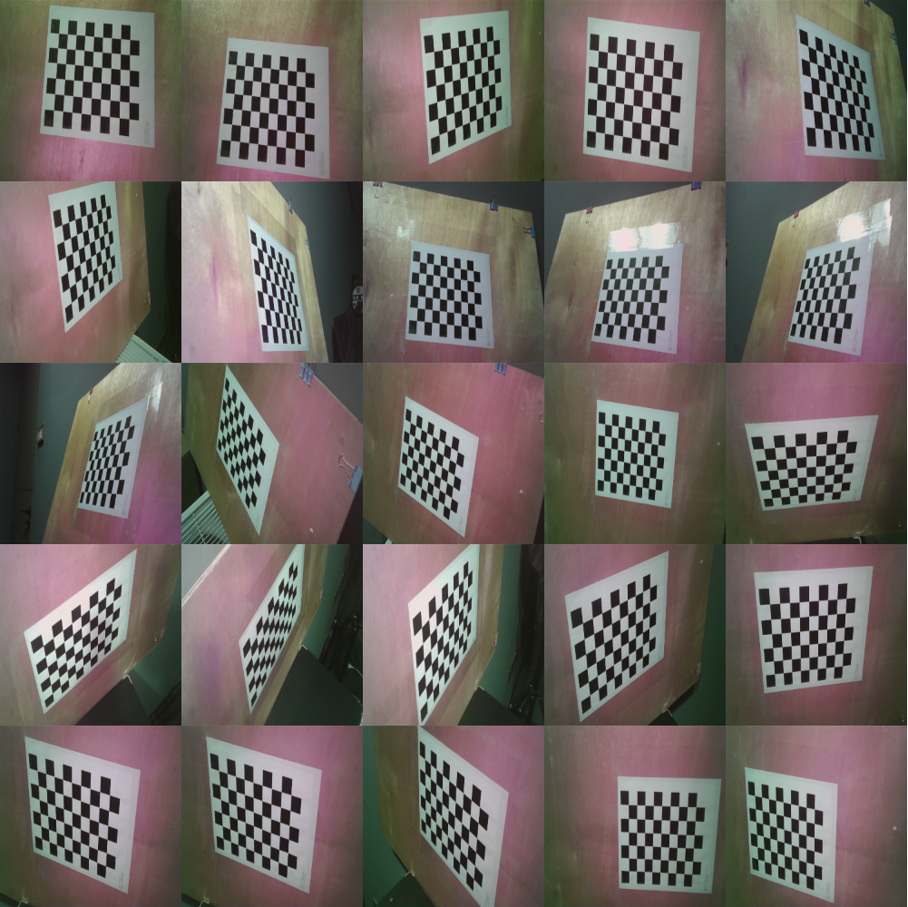
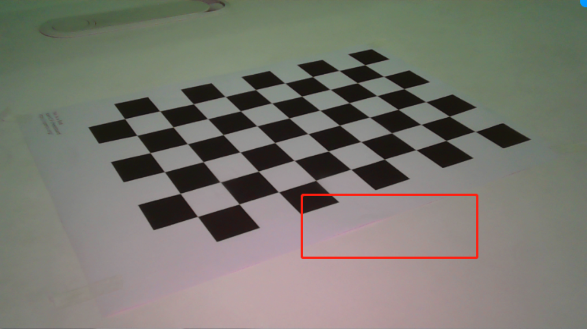
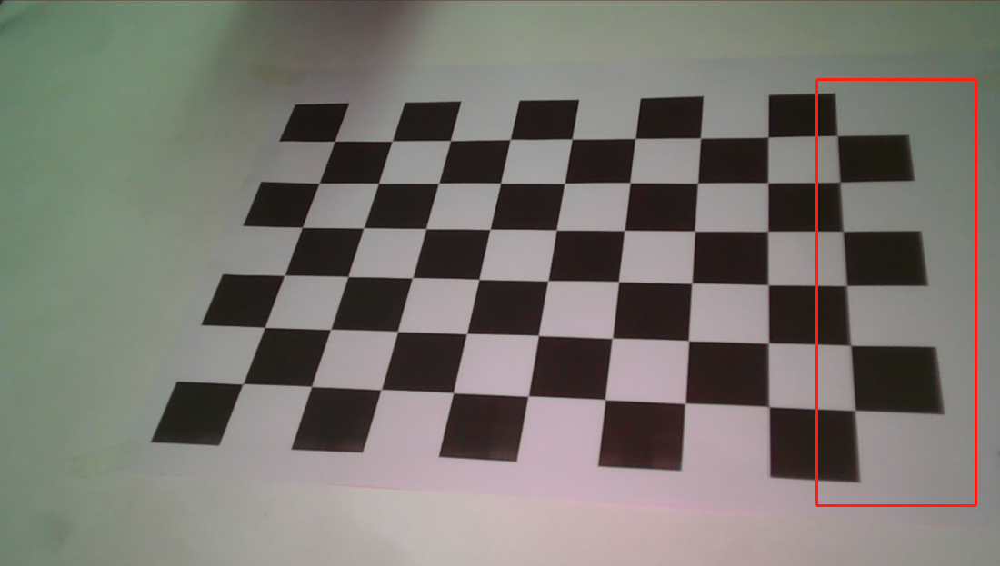
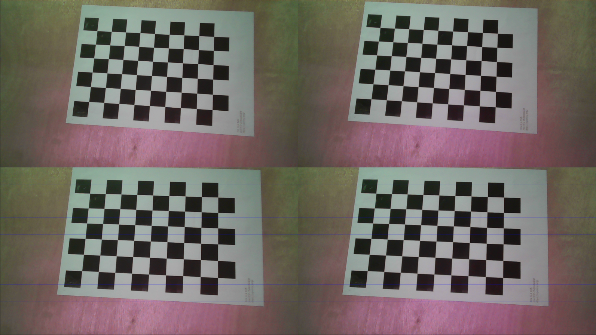
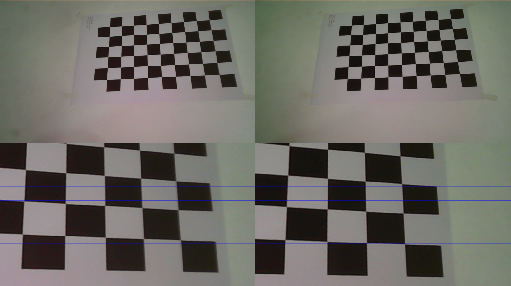

# 双目标定

下文中所提到的工作目录为 `stereo_calibration` 文件夹。

## python环境配置
首先确认按照[python环境配置](../python_env/contents.md)进行python环境的准备，并在 anaconda prompt 窗口中移动到工作目录下。

## 采集数据
首先打印一张如下的棋盘格子，并量取打印好的棋盘格子的方格大小。比如0.02米。
将棋盘格子平整的平铺在某个平面上（不能有任何起翘，褶皱），并用胶带固定住。


接着更换相机和棋盘格子之间的相对位置拍摄30张图像，可以采用固定相机移动棋盘格子所在平面（推荐），或者固定棋盘格子平面移动相机的方式进行拍摄。每一张的拍摄过程需要保持相机和棋盘格子固定，不能抖动相机或者棋盘格子，导致成像产生运动模糊。结果如下图所示：


以下是一些错误的示范：
棋盘格子没有严格平铺在平面上，图中画框部分纸面有起伏空隙：


拍摄图片存在运动模糊：



数据的命名规范并须符左目为`left*.png`和右目为`right*.png`，例如`left_0.png`, `right_0.png` ……
将采集到的图片数据全部放入同一个文件夹中。


## 相机标定
假设将拍摄好的30张图片放在工作目录下的 chess_board_imgs_dir 中，且实际拍摄出来的棋盘格方格大小为 0.025 米。运行如下代码：
```
python run.py -i ./chess_board_imgs_dir -o ./calib_params.txt --square_size 0.025 --vis --vis_path ./stereo_cal_vis
```
其中 `-i` 指定的是保存30张棋盘格子的文件夹路径，`-o` 指定的是最终保存标定好的相机参数文件路径，`--square_size` 指定的是打印出来的棋盘格子方格尺寸（单位为：米），`--vis` 为可视化开关，有这个参数的时候会进行标定好后矫正图的可视化。可视化存图路径由 `--vis_path` 参数指定。如果当 `--vis` 开启时却没有输入 `--vis_path` 和对应路径，则可视化路径将保存在运行代码所在的目录下的 `stereo_cal_vis` 文件夹中。

因此，运行上述示例后标定参数将被保存在工作目录的 calib_params.txt 中。可视化结果存在工作目录的 stereo_cal_vis。

运行过程中，终端上会打印出很多信息，其中有可能出现`warning`信息，跳过了某些图片，如：`[WARNING] skip /stereo_calibration/chess_board_imgs_dir/right_17.png!`。说明该图拍摄质量欠佳，算法没有找到相应的棋盘格角点。如果只有一两个`warning`信息时，可以忽略不管，但是如果出现了10个以上的`warning`，说明拍摄问题比较严重，需要重新进行数据采集并完成整体流程（要严格按照采集数据中的要求进行数据采集）。

## 验证
运行上述代码后，在终端上会打印出内参矫正时的重投影误差和双目矫正时的重投影误差。例如：
```
Intrinsic calibration: left reprojection error=0.5019101302692021 right reprojection error=0.5068912191638358
Stereo reprojection error=0.5338042008663725。
```
其中这些误差最好都控制在0.65以下。当然，最重要的是通过矫正后的可视化图片进行验证。可视化图片存储在上条脚本你键入的`--vis_path`中。文件夹中的每张图片对应采集图片中的左右目图像对。每张图片第一行的两列为矫正前的原图，第二行两列为双目矫正后的结果图，并带有水平参考线。如下图所示：


检查每张图中第二行中的图片，棋盘格每个方格的同一个角点在对应图片中是否处于同一水平线上（通过参考线大致判断）。如果处于同一条水平线上，矫正成功，配准结束。如上图所示。否则则失败，如下图所示：


如果配准失败，则需要重新回到数据采集环节，并走完整个流程，直到配准成功。


